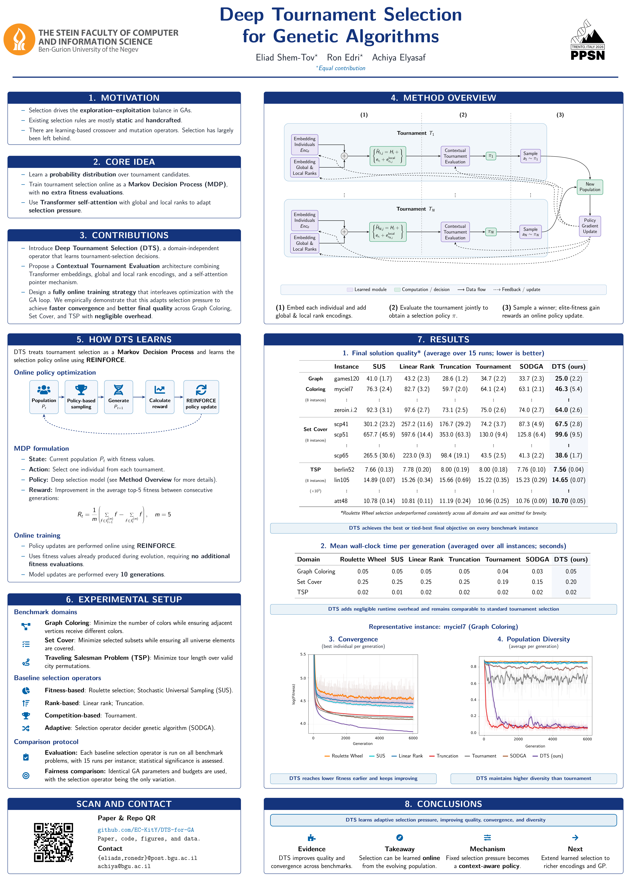

# Deep Tournament Selection (DTS) — Thesis Poster

This repository contains the LaTeX source files, assets, and compiled PDF for the **Deep Tournament Selection (DTS)** thesis poster.



## 📄 Overview

**Deep Tournament Selection (DTS)** introduces a learned, reinforcement learning-trained selection operator for Evolutionary Algorithms (EAs). DTS dynamically adapts parent selection based on population state and search progression, outperforming traditional selection operators across combinatorial optimization domains such as TSP, Graph Coloring, and Set Cover.

- **Poster File (PDF):** [poster.pdf](poster.pdf)
- **Source Code (LaTeX):** [poster.tex](poster.tex)

## 🛠️ Building the Poster

To compile the LaTeX poster locally, ensure you have TeX Live / MacTeX installed with `beamerposter` and standard packages.

```bash
export PATH="/Library/TeX/texbin:$PATH"
latexmk -pdf poster.tex
```

Or using `pdflatex`:

```bash
pdflatex poster.tex
```

## 📂 Repository Structure

```
.
├── poster.tex           # Main LaTeX source file
├── poster.pdf           # Compiled poster PDF
├── poster_page.png      # High-resolution poster preview image
├── stein_logo.png       # University / Lab Logo
├── images/              # Plots, diagrams, and figures used in the poster
├── .gitignore           # Git ignore rules for TeX build artifacts
└── README.md            # Repository documentation
```
